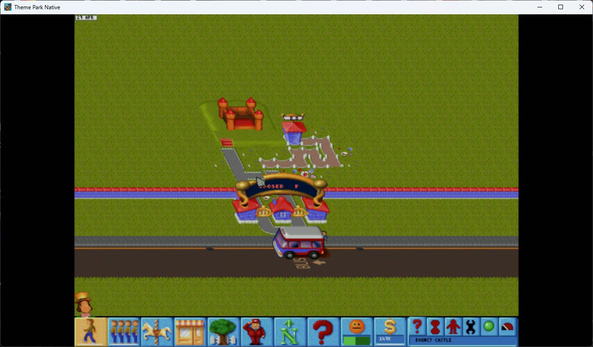
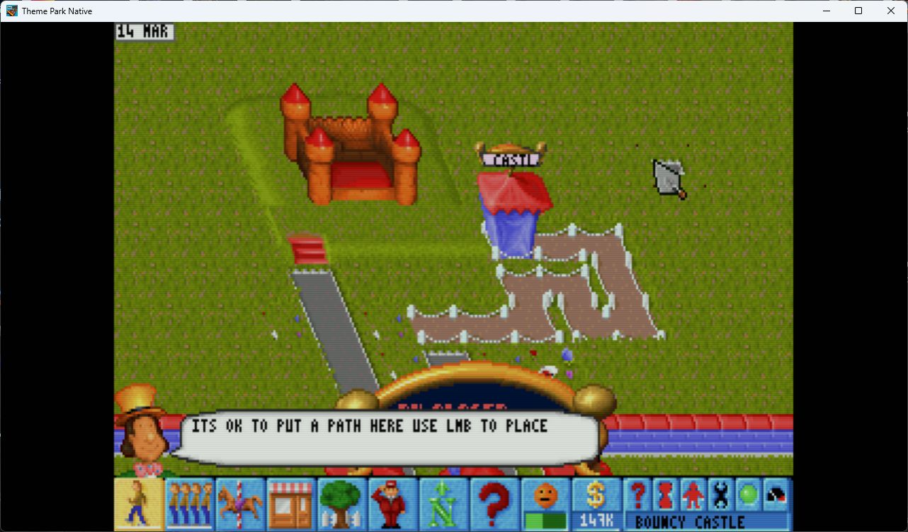

# Theme Park Native

Theme Park Native is an unofficial Windows 11 modernization layer for the 1994
PC CD release of **Theme Park** by Bullfrog Productions. It launches the
original game directly in a native window—without exposing a DOS prompt,
installer, DOS/4GW splash, or emulator menu—and integrates modern video, audio,
mouse, keyboard, and Xbox controller handling.

> [!WARNING]
> **This project is not currently playable.** CPU timing is constrained enough
> to keep the simulation near its intended speed, but map scrolling remains
> severely slow and clunky. Raising the emulated CPU rate restores scrolling
> responsiveness but makes the simulation run too fast. Resolving those two
> clocks independently is the main release blocker. This repository is public
> for development and testing, not as a finished replacement for the original.



| Original VGA mode | High-resolution VESA mode |
|---|---|
|  |  |

The repository contains **no playable original game program or extractable
game asset library**. Testers must own the PC CD version and import its
executable, artwork, data, music, and sound effects from their own disc image.

## Implemented so far

- One native x64 Windows executable, built with Visual Studio and Direct3D 11.
- An embedded compatibility engine; DOS startup and emulator UI remain hidden.
- Direct first-run CD import; the obsolete DOS installer is never shown.
- Original 320x200 VGA and 640x480 VESA modes at their intended aspect ratio.
- Edge-aware reconstruction, restrained sharpening, and a configurable CRT
  simulation with scanlines, phosphor mask, glow, and halation.
- Sound Blaster sound effects and AdLib music at unity gain.
- Immediate mouse tracking with a compatibility repair for the original
  VGA/VESA cursor-freeze bug.
- XInput controller support, v-synchronized flip-model presentation,
  fullscreen switching, and optional save states.

## Current blocker: scrolling and simulation timing

Theme Park couples several visible behaviors to the emulated CPU rate. At the
rate that keeps construction, visitors, finances, animations, and other
simulation systems close to original speed, edge scrolling is unacceptably
slow and uneven. Increasing the rate makes scrolling feel better but accelerates
the entire game.

A proper fix must identify and separate the scrolling/input cadence from the
authoritative simulation clock. Simply increasing cycles, inserting native
frame interpolation, or smoothing the mouse does not solve the underlying
coupling. Until that work is complete, the project must be considered
unplayable despite the working launch, graphics, sound, and input paths.

## What testers need

- 64-bit Windows 11.
- A Direct3D 11-capable graphics adapter.
- A legally owned PC CD image of Theme Park.

Unlike mixed-mode CD games, Theme Park stores its music and effects in game
data files. A normal ISO contains the complete soundtrack and sound library;
separate CD-audio extraction is not required. BIN/CUE and ZIP sources are also
accepted by the importer.

## Install for testing

1. Download a test build and extract the complete archive to a writable folder.
   Do not run the executable from inside the ZIP file.
2. Start `ThemePark2Native.exe`.
3. On first launch, select your `.iso`, `.cue`, or `.zip` CD image.
4. Wait while the wizard validates and extracts the original game files.
5. The game starts directly; its DOS installer does not need to be run.

Later launches use the imported files automatically. The installation is
portable: move the entire folder together and it will continue to work.

## Controls

| Action | Keyboard and mouse | Xbox controller |
|---|---|---|
| Point | Mouse | Right stick |
| Left click | Left mouse button | `A` or right trigger |
| Right click | Right mouse button | `B` or left trigger |
| Menu navigation | Arrow keys | D-pad |
| Toggle VGA/VESA mode | `R` | — |
| Fireworks | `F` | `X` |
| Open park | `O` | `Y` |
| Pause | `P` | Menu |
| Game Escape action | `Esc` | View |
| Toggle fullscreen | `Alt+Enter` | — |
| Release captured mouse | `Ctrl+F10` | — |
| Save / load state | `Ctrl+F5` / `Ctrl+F9` | — |

The Windows pointer is hidden over the active game and returns when the window
loses focus. When the original game exits, the native window exits with it.
See [the complete controls guide](docs/CONTROLS.md) for input details.

## Building from source

Install Visual Studio 2022 with **Desktop development with C++** and a Windows
SDK. Open `ThemePark2Native.sln` and build `Release | x64`, or use:

```powershell
.\build-release.ps1
```

To build and assemble a test directory in one operation:

```powershell
.\build-release.ps1 -RuntimeDirectory 'C:\Games\Theme Park'
```

The project uses MSVC only; WSL, MinGW, Java, and a separate compatibility-core
build are not part of the build or user installation. Authored code, scripts,
and shader modules stay below 300 lines per file and are commented for readers
who are new to C++ and emulation projects.

## Documentation

- [Architecture](docs/ARCHITECTURE.md)
- [Rendering and scaling](docs/RENDERING.md)
- [Disc import](docs/IMPORTING.md)
- [Music and sound effects](docs/MUSIC.md)
- [Engine research](docs/ENGINE-HOOKS.md)
- [Development guide](docs/DEVELOPMENT.md)
- [Packaging public builds](docs/DISTRIBUTION.md)
- [Third-party components](docs/THIRD-PARTY.md)

The `main` branch is the stable original-framebuffer development baseline. The
`widescreen-test` branch preserves incomplete reverse-engineering experiments
and is not recommended for normal testing.

## Legal

The source is licensed under [GPL-2.0-only](LICENSE) because the executable
embeds DOSBox Pure. Third-party components retain their own notices, documented
in [docs/THIRD-PARTY.md](docs/THIRD-PARTY.md).

This is an unofficial preservation and interoperability project. Theme Park,
Bullfrog, Electronic Arts, and all original game content belong to their
respective owners. The small screenshots above document interoperability; the
executable cannot use them as game data.
